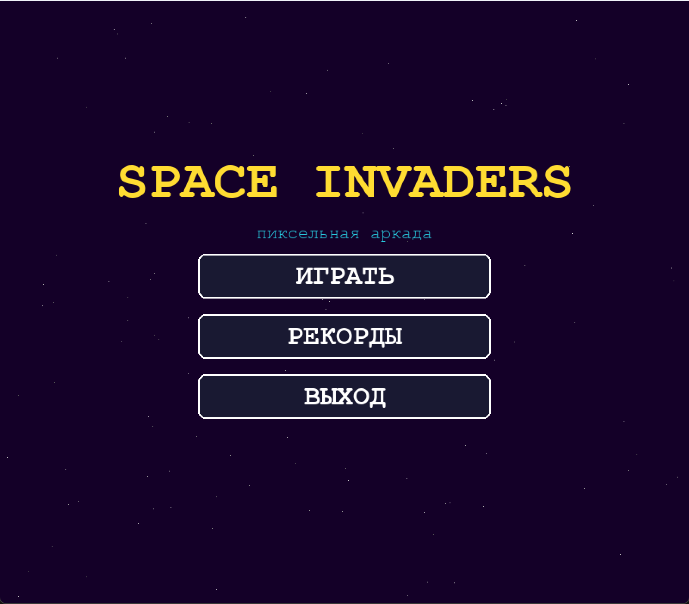
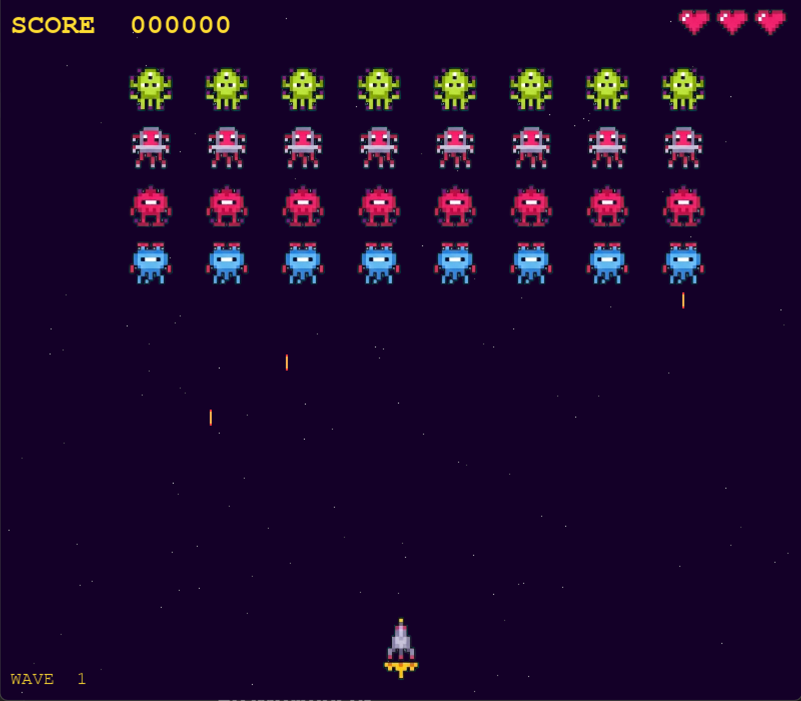
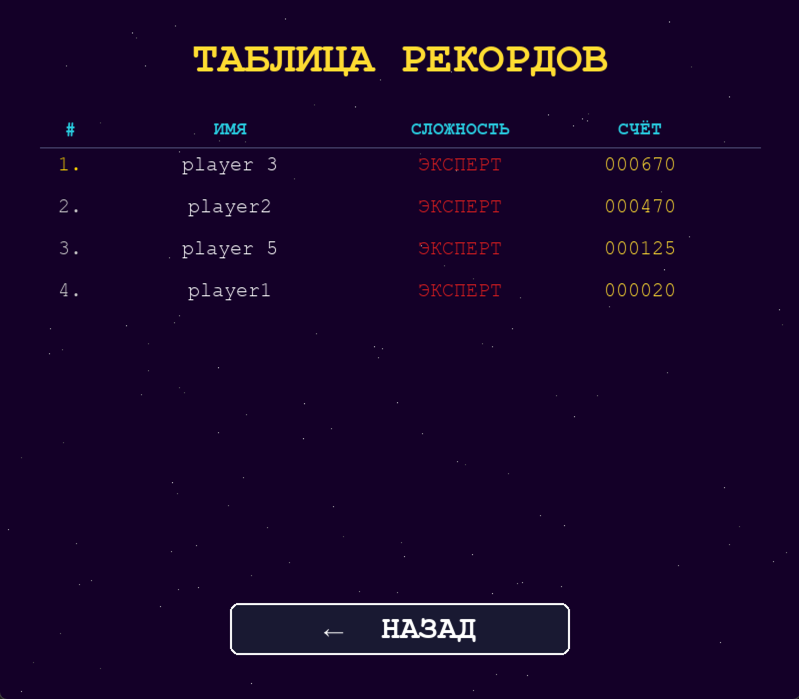

# Space Invaders на Python

#### 2D-аркадный шутер с бесконечными волнами, выбором сложности и таблицей рекордов

---

## Скриншоты

**Главное меню**



**Игровой процесс**



**Таблица рекордов**



---

## 1. Назначение

Space Invaders — десктопная 2D-игра в жанре фиксированного шутера, реализованная в рамках курсовой работы по дисциплине «Программирование». Игрок управляет кораблём в нижней части экрана и уничтожает волны инопланетян, которые ускоряются по мере гибели. Игра бесконечна — победить нельзя, можно только продержаться дольше и набрать больше очков.

---

## 2. Стек

| Компонент | Решение |
|-----------|---------|
| Язык | Python 3.10+ |
| Графика / звук / события | pygame-ce 2.4+ |
| Генерация звуков | NumPy |
| Хранение рекордов | JSON (стандартная библиотека) |
| Тип приложения | Desktop, без интернета |
| Система контроля версий | Git |

---

## 3. Установка и запуск

```bash
# 1. Клонировать репозиторий
git clone https://github.com/ripeeerr/space-invaders.git
cd space-invaders

# 2. Установить зависимости
pip install -r requirements.txt

# 3. Запустить
python main.py
```

**requirements.txt:**
```
pygame-ce>=2.4.0
numpy>=1.24.0
```

---

## 4. Управление

| Клавиша | Действие |
|---------|----------|
| `A` / `←` | Движение влево |
| `D` / `→` | Движение вправо |
| `Пробел` | Выстрел |
| `Q` / `Esc` | Выход |
| `R` | Рестарт (на экране Game Over) |

---

## 5. Игровые механики

### 5.1 Корабль игрока

- Движется горизонтально по нижней части экрана
- Кулдаун выстрела: **0.45 секунды** — исключает спам пулями
- После получения урона: **1.5 секунды неуязвимости** с миганием
- Хитбокс составляет **55% от размера спрайта** — пуля рядом с крылом не засчитывается как попадание

Технически реализовано через два прямоугольника:
- `vis_rect` — полного размера, для отрисовки
- `rect` — 55% от спрайта, для столкновений

### 5.2 Враги

Сетка **4 ряда × 8 колонн** = 32 врага на старте волны. Каждый ряд — свой тип:

| Ряд | Тип | Очки |
|-----|-----|------|
| 1 (верхний) | Зелёный | 30 |
| 2 | Красно-розовый | 20 |
| 3 | Тёмно-красный | 15 |
| 4 (нижний) | Синий | 10 |

Вся сетка двигается горизонтально как единое целое. При достижении края — разворачивается и опускается вниз.

**Ускорение:** интервал между шагами уменьшается линейно пропорционально доле выживших. При одном оставшемся враге он движется практически непрерывно.

### 5.3 Стрельба врагов

Реализована **очередь по колоннам**:

1. Раз в несколько секунд (случайный интервал из диапазона сложности) выбирается случайная живая колонна
2. Стреляет **самый нижний враг** в колонне — единственный, чья пуля долетит до игрока
3. Одновременно на экране не более **N вражеских пуль** (зависит от сложности)

Это исключает одновременный залп от всех 32 врагов.

### 5.4 Система волн

- После уничтожения волны — пауза **2.5 секунды** с баннером
- Каждая следующая волна быстрее предыдущей
- Жизни и счёт **сохраняются** между волнами
- Игра бесконечна

### 5.5 Столкновения

```python
# Пули игрока → враги (удалить обоих)
hits = pygame.sprite.groupcollide(
    enemy_group, player_bullets, dokilla=True, dokillb=True
)

# Пули врагов → игрок (через маленький rect)
pygame.sprite.spritecollide(player, enemy_bullets, dokill=True)
```

---

## 6. Уровни сложности

| Параметр | Легко | Средне | Эксперт |
|----------|-------|--------|---------|
| Мин. интервал стрельбы (сек) | 3.0 | 1.8 | 0.8 |
| Макс. интервал стрельбы (сек) | 6.0 | 4.0 | 2.0 |
| Макс. пуль на экране | 3 | 5 | 8 |
| Ускорение за волну | медленное | среднее | быстрое |

Реализовано через словарь `DIFFICULTY_PRESETS` в `settings.py`. `Swarm` получает нужный пресет как параметр конструктора.

---

## 7. Таблица рекордов

Хранится в `records.json` в корне проекта. Создаётся автоматически.

**Правила:**
- Поиск по имени без учёта регистра (`Alice` и `alice` — один игрок)
- Запись обновляется только при превышении предыдущего результата
- Список отсортирован по убыванию счёта

**Формат:**
```json
[
  {
    "name": "player 3",
    "difficulty": "expert",
    "score": 670
  }
]
```

---

## 8. Игровой цикл и delta time

```python
while True:
    dt = self._clock.tick(FPS) / 1000.0  # миллисекунды → секунды
    dt = min(dt, 0.05)                    # защита от скачков при лагах
    self._update(dt)
    self._draw()
    pygame.display.flip()
```

Все скорости умножаются на `dt`:
```python
self._x += dx * PLAYER_SPEED * dt  # 280 px/сек × dt сек
```

Это гарантирует одинаковое поведение на любом железе.

---

## 9. Звуковые эффекты

Все звуки генерируются **программно через NumPy** при запуске — без внешних файлов:

```python
chunk = np.sign(np.sin(2 * np.pi * freq * t))          # прямоугольная волна
chunk = 2 * (t * freq - np.floor(t * freq + 0.5))      # пилообразная
chunk = np.sin(2 * np.pi * freq * t)                   # синусоида
```

| Событие | Волна | Характер |
|---------|-------|---------|
| Выстрел игрока | Прямоугольная | Резкий, пиксельный |
| Взрыв врага | Пилообразная | Грубый шум |
| Попадание по игроку | Прямоугольная | Низкий удар |
| Победа над волной | Синусоида | Плавный аккорд |

---

## 10. Структура проекта

```
space_invaders/
│
├── main.py                  # Точка входа, управление экранами
├── settings.py              # Все константы и пресеты сложности
├── requirements.txt
├── records.json             # Таблица рекордов (создаётся автоматически)
│
├── screenshots/             # Скриншоты для README
│   ├── menu.png
│   ├── gameplay.png
│   └── leaderboard.png
│
├── assets/
│   └── sprites/             # PNG-файлы спрайтов с прозрачным фоном
│       ├── alien1.png ... alien4.png
│       ├── spaceship.png
│       ├── explosion1-3.png
│       └── heart_full/half/empty.png
│
├── core/
│   ├── game.py              # Игровой цикл и стейт-машина
│   ├── sprite_loader.py     # Загрузка PNG через pygame.image.load
│   ├── sounds.py            # Генерация звуков через NumPy
│   └── leaderboard.py       # Чтение/запись records.json
│
├── entities/
│   ├── player.py            # Корабль: движение, стрельба, хитбокс, мигание
│   ├── enemy.py             # Enemy + Swarm (контроллер роя)
│   ├── bullet.py            # PlayerBullet и EnemyBullet
│   └── effects.py           # Explosion (3 кадра) и Particle
│
└── ui/
    ├── menu.py              # Все экраны вне игры
    └── hud.py               # Счёт, жизни, номер волны
```

---

## 11. Ключевые файлы

### `settings.py`

Все числовые константы и пресеты сложности в одном месте. Для изменения баланса или масштабов — достаточно этого файла.

### `core/game.py`

Стейт-машина с тремя состояниями:

| Состояние | Что происходит |
|-----------|----------------|
| `playing` | Полный игровой цикл: движение, коллизии, проверки |
| `next_wave` | Пауза 2.5 сек, обратный отсчёт до следующей волны |
| `game_over` | Ожидание Enter, затем экран ввода имени |

### `entities/enemy.py`

Два класса:
- `Enemy` — один инопланетянин: спрайт, позиция, очковая стоимость
- `Swarm` — контроллер роя: движение, ускорение, очередь стрельбы

### `ui/menu.py`

Четыре экрана:
- `MainMenu` — кнопки с hover-подсветкой
- `DifficultyMenu` — выбор уровня с описанием при наведении
- `NameInputScreen` — ввод имени с мигающим курсором
- `LeaderboardScreen` — топ-10 с цветовой кодировкой сложности

---

## 12. Системные требования

| Параметр | Минимум |
|---------|---------|
| ОС | Windows 10, macOS 11+, Linux Ubuntu 20.04+ |
| Процессор | 1 ГГц |
| ОЗУ | 512 МБ |
| Видеокарта | OpenGL 2.0 (любая встроенная) |
| Python | 3.10+ |

---

## 13. Известные ограничения

- Статичные спрайты врагов (один кадр на тип, без анимации)
- Нет щитов (укрытий) как в оригинале 1978 года
- Нет боссов и powerup-объектов

Все перечисленные функции заложены в архитектуру и могут быть добавлены без переработки базовых классов.

---

